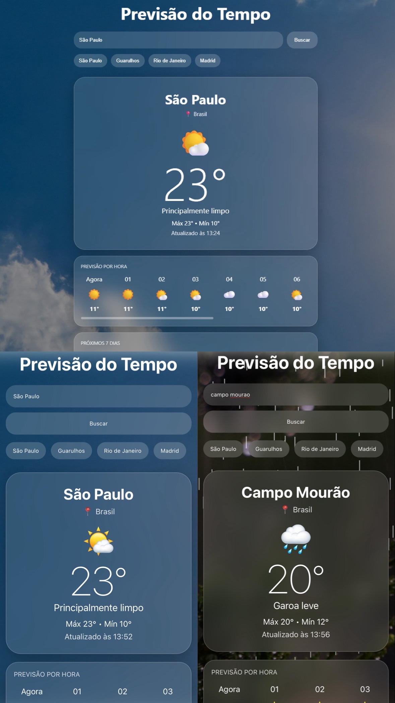

# 🌦️ SkyGlass

Aplicação web de previsão do tempo inspirada no aplicativo Tempo do iPhone, desenvolvida com HTML, CSS e JavaScript, utilizando a API Open-Meteo para fornecer informações meteorológicas em tempo real.

---

## 📸 Preview

<p align="center">
  
</p>

---

## 🚀 Demonstração

Projeto desenvolvido utilizando HTML, CSS e JavaScript com integração à API Open-Meteo para exibição de dados meteorológicos em tempo real.

Acesse a aplicação online:
🔗 https://carolinaperpetuo.github.io/SkyGlass/

---

## 📖 Sobre o Projeto

O **SkyGlass** é uma aplicação web de previsão do tempo inspirada no aplicativo Tempo do iPhone.
A aplicação utiliza as APIs da Open-Meteo para buscar informações meteorológicas em tempo real e exibi-las em uma interface moderna baseada no conceito de **Glassmorphism**, com fundos dinâmicos que se adaptam automaticamente às condições climáticas da cidade pesquisada.

---

## ✨ Funcionalidades

* Busca de cidades em tempo real
* Temperatura atual
* Sensação térmica
* Umidade do ar
* Velocidade do vento
* Chance de chuva
* Previsão por hora
* Previsão para os próximos 7 dias
* Fundo dinâmico baseado nas condições climáticas
* Tema noturno automático
* Atualização em tempo real
* Interface Glassmorphism inspirada no aplicativo Tempo do iPhone
* Layout responsivo para desktop e dispositivos móveis

---

## 🛠️ Tecnologias Utilizadas

* HTML5
* CSS3
* JavaScript
* Open-Meteo API
* Open-Meteo Geocoding API

---

## 📂 Estrutura do Projeto
```text
SKYGLASS
│
├── assets
│   ├── img
│   │   ├── preview
│   │   │   └── preview-completo.png
│   │   │
│   │   ├── ceu-limpo.jpg
│   │   ├── chuva.jpg
│   │   ├── ensolarado.jpg
│   │   ├── noite.jpg
│   │   ├── nublado.jpg
│   │   ├── parcialmente-nublado.jpg
│   │   └── tempestade.jpg
│
├── css
│   └── style.css
│
├── js
│   └── script.js
│
├── index.html
└── README.md
```

---

## 🌍 Como Funciona

1. O usuário informa o nome de uma cidade.
2. A aplicação consulta a API de geocodificação da Open-Meteo.
3. A API retorna a latitude e longitude da cidade.
4. A aplicação utiliza essas coordenadas para buscar os dados meteorológicos.
5. Os dados são exibidos na tela de forma amigável.
6. O fundo da aplicação muda automaticamente de acordo com o clima atual.

---

## 🎨 Fundos Dinâmicos

O projeto utiliza imagens diferentes de fundo conforme a condição climática retornada pela API.

| Condição             | Imagem                     |
| -------------------- | -------------------------- |
| Céu limpo            | `ceu-limpo.jpg`            |
| Ensolarado           | `ensolarado.jpg`           |
| Parcialmente nublado | `parcialmente-nublado.jpg` |
| Nublado / Neblina    | `nublado.jpg`              |
| Chuva                | `chuva.jpg`                |
| Tempestade           | `tempestade.jpg`           |
| Noite                | `noite.jpg`                |

---

## ⚙️ Como Executar o Projeto

Clone este repositório:
```bash
git clone https://github.com/CarolinaPerpetuo/SkyGlass.git
```

Acesse a pasta do projeto:
```bash
cd SkyGlass
```

Abra o arquivo `index.html` no navegador.
Também é possível executar utilizando a extensão **Live Server** no VS Code.

---

## 🔗 APIs Utilizadas

### Open-Meteo Geocoding API

Utilizada para buscar a latitude e longitude da cidade informada.
```text
https://geocoding-api.open-meteo.com
```

### Open-Meteo Forecast API

Utilizada para buscar os dados meteorológicos atuais, previsão por hora e previsão diária.
```text
https://api.open-meteo.com
```
---

## 📚 Aprendizados

Durante o desenvolvimento deste projeto foram praticados conceitos como:

* Consumo de APIs REST
* Programação assíncrona com `async/await`
* Manipulação do DOM
* Tratamento de erros
* Responsividade com CSS
* Efeito Glassmorphism
* Organização de arquivos em projeto front-end
* Uso de imagens dinâmicas conforme dados da API
* Deploy com GitHub Pages

---

## 👩‍💻 Desenvolvedora

**Carolina Perpetuo**

Engenheira de Software e Desenvolvedora Full Stack.

